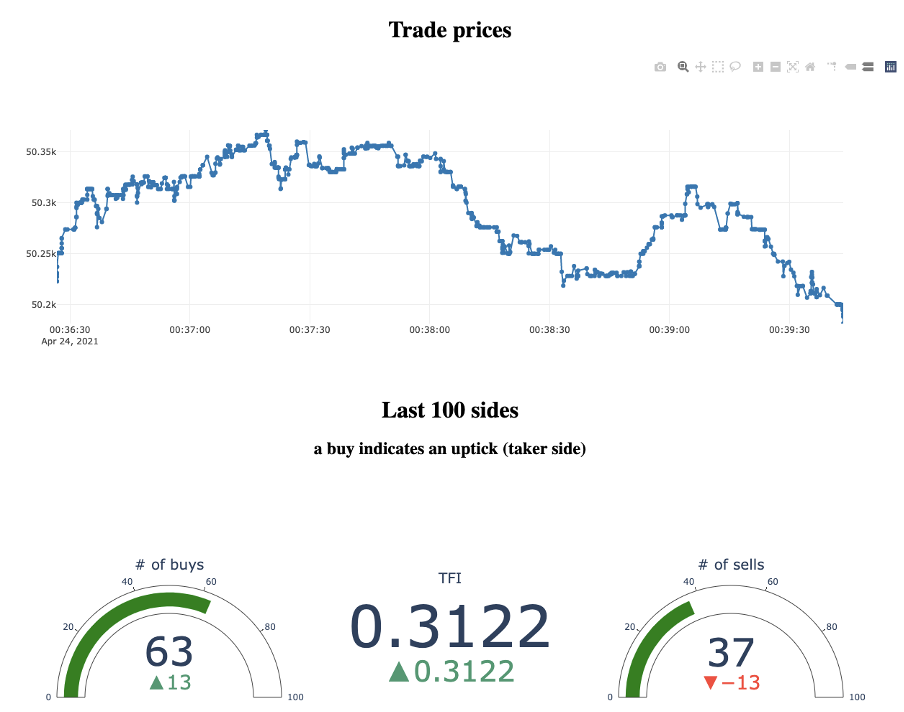
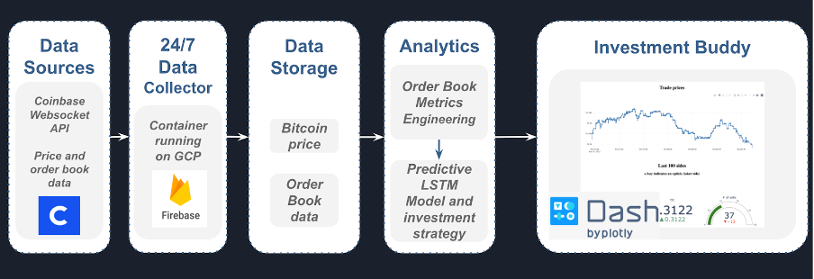

# bitcoin-prediction
Data-X project - UC Berkeley - Investment startegy testing 

This project was done by six UC Berkeley Data-X students: Armand Sauzay, Mathilde Bachy, Manav Kapoor, Vandita Pendse, Lauren Santilli, and Davis Ulrich under the mentorship of Francesco Piccoli, from Anchain.AI. 

The cryptocurrency market is a volatile space and has remained daunting to investors, on account of its uncertainty. Large corporations have the capable technology and resources to critically reduce this level of uncertainty, but private investors are often left behind because of the high barriers to enter crypto markets. We created the Bitcoin Investment Buddy in an effort to reduce some of these barriers for private investors to enter the Bitcoin market.

To read more about some of the problems facing cryptocurrencies and how our product can reduce the barriers to enter the Bitcoin market, check out our [News Release](https://docs.google.com/document/d/1ea5ZyZnH9OHuuA0zsYrKonssXJPPOqyg2m80dsapBAU/edit). 

# Architecture

Primary Features:
Bitcoin Investment Buddy is powered by an algorithmic trading strategy developed in the halls of the University of California, Berkeley. Why not a more complex machine learning model? After use of advanced machine learning techniques like LSTM and ARIMA, the team found that when it comes down to making money, simple is better. 
The algorithm has been backtested on months of data, all of which was imported via a Coinbase API and stored using Firebase. Under the hood, this data was cleaned to identify relevant features, and fed into the investment algorithm. The resulting recommendation is displayed on the UI dashboard for accessibility and ease to the consumer. 
On the top half of the dashboard, the Bitcoin Investment Buddy also contains a real time trades tracker, displaying the previous 1000 trades from the given instance. As a result, consumers can easily track real time market movements.
In the bottom half of the dashboard, the Bitcoin Investment Buddy also calculates the Trade Flow Imbalance, a relevant feature of the strategy, providing complete transparency of the trade recommendations to the consumer. 

# Reproducibility

Package Requirements

tensorflow==2.3.1
sklearn==0.23.2
plotly==4.9.0
firebase==1.2.1
pandas==1.0.1
numpy==1.18.5
dash==1.18.1

# How to run the projects 
## How to run the dashboard? 
1. Clone the repo 
2. Go to /final/dash/
3. Run dash-trades.py

## How to (back)test different investment strategies 
1. Go to /final/investment-strat
2. Open algo-trading.ipynb and follow the instructions

## How to get the LSTM results (~10 times better than baseline) 
1. Go to /final/modeling/lstm-final.ipynb and run all cells

# Additional Resources

Our programs utilize the Coinbase Pro API; its documentation can be found at: https://github.com/armand-sauzay/coinbasepro-python. 

 
# *Disclaimer*
This content and any tools or models referenced are not intended to be financial advice and should not serve as a recommendation to buy or sell any cryptocurrency, engage in any trading of cryptocurrency, or other activities. You must not rely on this content for any financial decisions. Acquiring, trading, and otherwise transacting with cryptocurrency involves significant risks and we strongly advise readers to conduct their own independent research before engaging in any such activities. 
